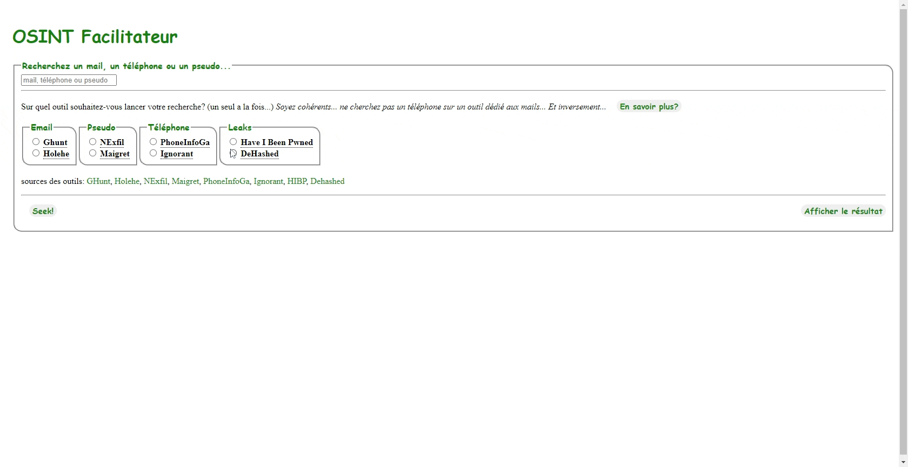

# FROS (Facilitateur de Recherches OpenSources)
Il s'agit uniquement d'un framework destiné à rendre disponible en web des outils d'OSINT disponibles en ligne de commande, sur un poste de travail.

C'est un "All-In-One" comprenant le serveur web et toutes les dépendances.

## Utilisation:
Ouvrez votre navigateur et rendez-vous sur l'adresse IP locale de la machine, ou bien "localhost". Entrez une recherche, choisissez l'outil qui vous intéresse et cliquez sur le bouton et regardez la magie opérer. 

Le temps de traitement varie de quelques secondes a quelques dizaines de secondes.

## Liste d'outils:
* [Ghunt] (https://github.com/mxrch/GHunt)
* [Holehe] (https://github.com/megadose/holehe)
* [Nexfil] (https://github.com/thewhiteh4t/nexfil)
* [Maifret] (https://github.com/soxoj/maigret)
* [PhoneInfoGa] (https://github.com/sundowndev/phoneinfoga)
* [Ignorant] (https://github.com/megadose/ignorant)

## Fonctionalités:
Le serveur web utilisé est Caddy (https://caddyserver.com) accompagné de PHP 8.1. Dans sa configuration actuelle, il écoute le port 80, en http. Idéal pour un serveur accessible en LAN seulement.

Chaque outil est installé et utilisable par le serveur web (www-data). Ils sont tous localisés dans son répertoire utilisateur (/home/www-data).

Les programmes sont exécutés grâce à ttyd (https://github.com/tsl0922/ttyd), qui permet d'afficher le terminal sur une page internet. PHP appelle directement les programmes et affiche le résultat en temps réel dans le navigateur.

## Installation:
Il vous faut une machine avec un système d'exploitation Ubuntu avec des droits d'administration et une dizaine de minutes. L'outil est testé avec Ubuntu 20.04.4 LTS, mais devrait fonctionner sur tous les "debian".

1. Récupérez le script d'installation et exécutez le, soit en root, soit avec sudo: `chmod +x install.sh && sudo ./install.sh`  
2. Laissez faire jusqu'à ce que l'on vous propose d'entrer vos cookies pour GHunt: (https://github.com/mxrch/GHunt#where-i-get-these-cookies-) 
3. Choisissez votre méthode et tout est terminé 

## Emplacement des fichiers:
* La configuration du serveur caddy se trouve dans le répertoire `/etc/caddy/Caddyfile`.
* Le corps du site se trouve dans `/var/www/html`.

Have fun !!
